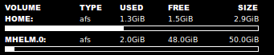

Desktop candy and scripts for HPC
=================================
This is a collection of scripts with a `.conkyrc`, to keep track of the status
of remote machines at HPC facilities. It can also fetch information about queue
and node status from EASY and TORQUE.

*Note that this README will soon be updated to better suit the general public.* 

The whole thing looks like the image below. Scroll down for info!


Getting Conky
--------------
Install conky through your package manager, build it yourself or use my module for NADABUNTU.
It's located at:

```
/afs/pdc.kth.se/misc/pdc/support-group/modules/Modules/sys/conky
/afs/pdc.kth.se/misc/pdc/support-group/modules/conky/current/this
```

See below how to use it.

### If not using the module
Conky can be downloaded from [this webpage](http://conky.sourceforge.net) at sourceforge.
On a NADABUNTU computer, I had to build the dependency lua, [link here](http://www.lua.org/download.html).

Build and install it locally, or from your package manager. Ask me if you can't figure it out.

Get conkyrc and the scripts
---------------------------

```bash
# Clone my repo
git clone /afs/pdc.kth.se/misc/pdc/support-group/repos/conky-monitoring.git ~/conky
```

Set the `$MACHINE` variable in `~/conky/settings` to the machines you want to get status for.

Starting Conky
--------------
To avoid creating lots of connections, the `conky_multiplex` script is executed before starting conky.
This sets up multiplexed SSH sessions to ellen, ferlin, lindgren, povel and zorn.
These are then used by conky through the `conky_ssh` script.
If this is not desired, you just need to change that script, as well as some lines in `.conkyrc` that checks for existance of the SSH sockets.

In the repo, there is a file called `conky_env`. It will set up some environment variables, load the conky module, start conky and finally launch a python script to kill the SSH-sessions upon logout.

To start conky on a NADABUNTU machine, if cloned as above, simply do:

```bash
~/conky/conky_env
```

Then close the terminal. This file should be customized if you want to do things differently.

To load it on login you can add the the following command to startup

```bash
bash -c "sleep 20; ~/conky/conky_env"
```

If you don't want to let the python script kill the backgrounded SSH-sessions, you can kill them yourself using
```bash
~/conky/scipts/kill_conky_ssh
```

.conkyrc
--------
The whole thing looks like the image at the top. My `conkyrc` and the scripts is in a git repo located at `/afs/pdc.kth.se/misc/pdc/support-group/repos/conky-monitoring.git`.

Below follows a small rundown of the different parts.

### AFS-volumes


#### `.conkyrc` example
Checking AFS stats on home directory every 10 minutes.

```
${font arial black:size=7}VOLUME${goto 100}TYPE${goto 150}USED${goto 210}FREE${alignr 1}SIZE$font
${font arial black:size=7}HOME:$font${goto 100}afs${goto 150}${execi 600 $CONKY_HOME/scripts/fs-conky used ~}${goto 210}${execi 600 $CONKY_HOME/scripts/fs-conky free ~}${alignr}${execi 600 $CONKY_HOME/scripts/fs-conky size ~}
${execibar 600 $CONKY_HOME/scripts/fs-conky percent ~}
```

For more details, see the `scripts/fs-conky`.

### Ping, load and top on a remote machine
Part that checks status of different machines. This uses multiplexed SSH sessions in the given `conky_ssh` script.
The `machine-status` script tests if the machine responds to ping. If it responds, it checks the load and top (cpu) process on that host and outputs it according to the template in `templates/machine-status`.


#### `.conkyrc` example
Checking status on all `$MACHINES` every 120 seconds:

```
${execpi 120 $CONKY_HOME/scripts/machine-status}
```

For more details, see the `scripts/machine-status`.

### Use and abuse of interactive nodes on Lindgren
Checks for interactive jobs that has been running for more than 1h.
If such jobs are found, stats are printed about those jobs.
It also reports how many of the interative nodes are in use and how many interactive jobs are running.


#### `.conkyrc` example
Check the interactive nodes on Lindgren every 15 minutes.

```
${font arial black:size=7}INTERACTIVE JOBS > 1h${font}
${execi 900 $CONKY_HOME/scripts/conky_ssh lindgren "$CONKY_HOME/scripts/interabuse"}
```

See `scripts/interabuse` for more details.

### Lindgren queue
Reports stats of your jobs in the queue. Active, idle and blocked.
If you have no jobs in the queue, it reports the number of eligeble jobs in the queue.


This one prints output to be parsed by conky, so the formatting has to be changed in the script if desired.
#### `.conkyrc` example
Check the queue every 5 min.

```
${execpi 300 $CONKY_HOME/scripts/conky_ssh lindgren "$CONKY_HOME/scripts/showmyq"}
```

See `scripts/showmyq` for details.

### Stats from EASY
Reports how many nodes are up/defined on a machine running EASY.


#### `.conkyrc` example
Check EASY stats on povel every 5 min.

```
${font arial black:size=7}POVEL: ${font}\
${execi 300 $CONKY_HOME/scripts/conky_ssh povel "module add python/2.7.5 && module add easy && $CONKY_HOME/scripts/easystat"}
```

See `scripts/easystat` for more details.
